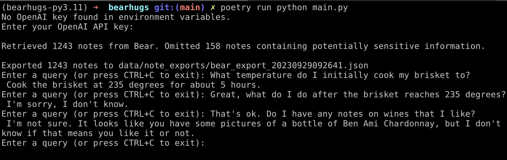

## Hug your Bear Notes with AI

This is a project built on Langchain and ChromaDB, leveraging OpenAI as the hosted LLM.

Only MacOS is supported as this will retreive your notes from the sqllite database that Bear Notes uses, rather than using the `X-callback-url` hack.

Right now running this will export all of your Bear Notes to a json file and then you can chat with them provided you input your OpenAI API key or provide it as the standard `OPENAI_API_KEY` environment variable.

Note: It can be a bit slow to respond (pretty typical w/ OpenAI API), there are some optmizations planned:

- Don't export and generate embeddings on every run.
- Local LLM support
- more TBD

### Get going

I highly recommend using [Poetry](https://python-poetry.org/) to install all dependencies

```
poetry install
```

Then just run:

```
poetry run python main.py
```

You'll be prompted for your OpenAI API key if it's not provided as an environment variable, and then you can provide a prompt. Below you can see some questions I asked about my brisket recipe and wines that I like.



### Data Privacy w/ OpenAI's API
Per their documentation:
'OpenAI will not use data submitted by customers via our API to train or improve our models, unless you explicitly decide to share your data with us for this purpose.`

## Exporting Bear Notes to markdown

You can provide the `export-markdown` argument to the script to export all of your notes individually to markdown files should you wish to feed them to a tool like [mem.ai](https://mem.ai).

```
poetry run python main.py export-markdown
```

Files are written to `./data` and purged each time you export.
Some notes will not be exported if they contain certain keywords that may indicate sensitve contents.
Check out the [`contains_sensitive_info()`](https://github.com/aflansburg/bearhugs/blob/main/bearhugs/notes.py#L17) method.
